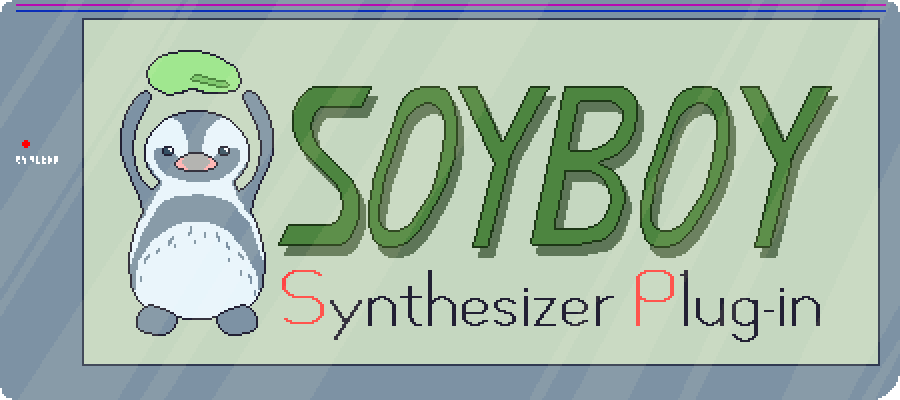

# SoyBoy SP - A GameBoy instrument

I want to do some chiptunes on GNU/Linux.

[*Edamame* is the Humboldt penguin living in Tobu Zoo](https://twitter.com/tobuzoo7/status/982488509725327361).

## TODOs

- [x] VST3 related
    - [x] plugin do nothing
    - [x] signal processing
    - [x] controllable parameters
    - [x] Original GUI?
        - [x] design UI
        - [x] implement UI
        - [ ] show version on UI
- [ ] plugin features
    - [x] square wave osillator
        - [x] oscillate with fixed duty ratio
        - [x] duty ratio parameter
        - [x] frequency sweep unit
    - [x] envelope generator
        - [x] generate ADSR envelope
        - [x] make output 4-bit value
    - [x] noise oscillator
        - [x] oscillate with fixed period
        - [x] periods for random number generation
    - [x] wave table oscillator
        - [x] oscillate with fixed table
        - [x] modify wave table with index parameter
    - [x] pitch bend
    - [x] note velocity
    - [x] note stutter (note delay)
    - [x] DAC simulation
    - [x] frequency sweep for all oscillators
    - [x] make soyboy a single voice unit (preparation for be a polyphonic synth)
    - [ ] structured VST3 state
- [ ] future work
    - [ ] can be polyphonic
    - [ ] multiple switchable wavetables

## References

- [Gameboy sound hardware - GbdevWiki](https://gbdev.gg8.se/wiki/articles/Gameboy_sound_hardware)
- [vst3-sys examples](https://github.com/RustAudio/vst3-sys/tree/master/examples)
- [How to create VST3 plugins (Japanese)](https://vstcpp.wpblog.jp/?page_id=1316)

## Author

- Shinichi Tanaka (<shinichi.tanaka45@gmail.com>)

## License

This project is lisenced under the GPLv3 because of [Steinberg's licensing poricy](https://developer.steinberg.help/display/VST/VST+3+Licensing).
