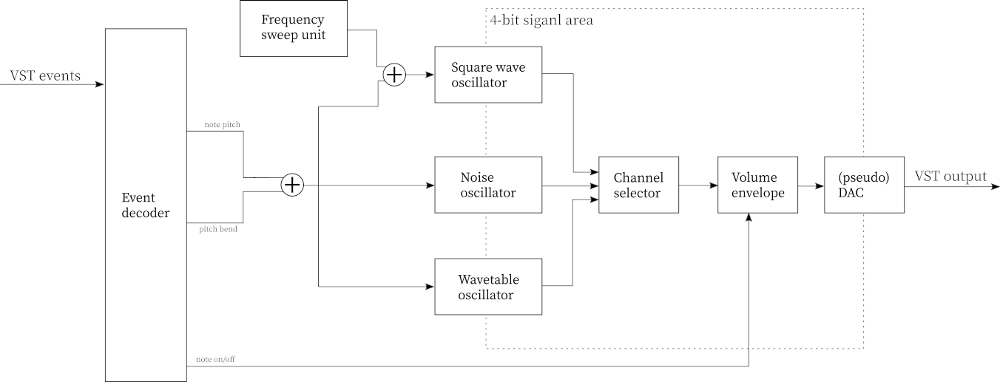

# GBI: Design notes

## Implementation memo

- GameBoy sound generation are made at every 1/2097152 (every 2 clocks in GameBoy CPU)
  - DSP may process with 44.1kHz (but GB sound processing occurs with 2.097152 MHz.
  - so DSP must be emulate that process with [sampling frequency conversion](https://en.wikipedia.org/wiki/Sample-rate_conversion)

## Block diagram

This may be one oscillation unit for polyphonic synths.

## Controlable parameters

### List of Parameters

- general parameters
    - master volume
    - DAC simulation on/off
    - oscillator selection
    - pitch bend
- volume envelope parameters
    - attack
    - decay
    - sustain
    - release
- square wave oscillator
    - duty ratio
    - frequency sweep on/off
    - frequency sweep negate
    - frequency sweep intensity
    - frequency sweep period
    - sweep LFO (triangle wave) on/off
- wave table oscillator
    - wavetable entry (#0 ~ #31)
- noise oscillator
    - WIP...
- note stutter
- arpeggiator

### Parameter details

#### General parameters

- master volume
    - 0.0 ~ 1.0
    - or decibel (db)?

- oscillator select
    - 0: square wave
    - 1: noise
    - 2: wavetable

- DAC simulation on/off
    - 0: off
    - 1: on

- pitch bend
    - 0 ~ 2027
    - https://gbdev.gg8.se/wiki/articles/Gameboy_sound_hardware#Square_Wave
    - https://gbdev.gg8.se/wiki/articles/Gameboy_sound_hardware#Wave_Channel
    - https://gbdev.gg8.se/wiki/articles/Sound_Controller#FF19_-_NR24_-_Channel_2_Frequency_hi_data_.28R.2FW.29

#### Volume envelope parameters

It's a simple 4-bit ADSR envelope generator.

- attack
    - 0 ~ ??? (1.0s)

- decay
    - 0 ~ ??? (1.0s)

- sustain
    - 0.0 ~ 1.0 (1.0s)

- release
    - 0 ~ ??? (1.0s)

#### Square wave channel parameters

- duty ratio
    - 12.5%
    - 25%
    - 50%
    - (75%?)

- frequency sweep on/off
    - 0: off
    - 1: on

- frequency sweep negate
    - 0: false
    - 1: true

- frequency sweep intensity
    - 0 ~ 8

- frequency sweep period
    - 0 ~ 8

- sweep LFO (triangle wave) on/off
    - 0: off
    - 1: on

#### Wavetable channel parameters

- wavetable entry (#0 ~ #31)
    - 0 ~ 16 (4 bits)

#### Noise channel parameters

WIP...
